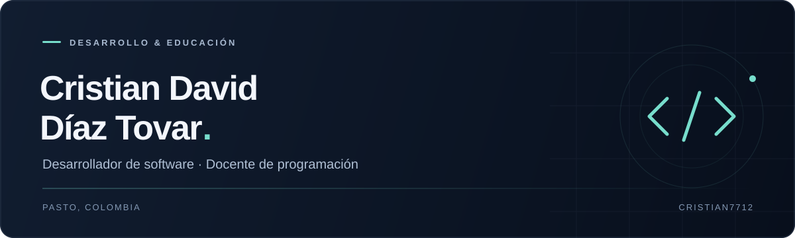

  

  Desarrollo soluciones prácticas y convierto conceptos complejos 
  en experiencias de aprendizaje claras.

  <a href="https://portafolio-personal-cristian-diaz.vercel.app/"><strong>Mi portafolio ↗</strong></a>
  &nbsp; · &nbsp;
  <a href="mailto:cristian.diaz8918@gmail.com"><strong>Hablemos ↗</strong></a>
  &nbsp; · &nbsp;
  <a href="https://github.com/cristian7712?tab=repositories"><strong>Mis repositorios ↗</strong></a>

 

## Software con propósito. Conocimiento que se comparte.

Soy **Cristian David Díaz Tovar**, desarrollador de software y docente de programación en **Pasto, Nariño, Colombia**. Me interesa el punto donde la tecnología y la educación se encuentran: construir herramientas útiles y ayudar a otras personas a entender cómo funcionan.

Mi trabajo parte de una idea sencilla: una buena solución debe ser tan clara de entender como práctica de usar. Por eso, doy prioridad a la lógica, al código mantenible y al aprendizaje a través de proyectos reales.

 

## Lo que guía mi trabajo

| Desarrollo de software | Enseñanza de programación |
| :--- | :--- |
| Transformar problemas en soluciones simples y mantenibles. | Conectar los fundamentos con su aplicación en proyectos reales. |
| Construir con atención a la calidad y a las buenas prácticas. | Explicar paso a paso, desde la lógica hasta la implementación. |
| Revisar, aprender e iterar para mejorar cada solución. | Crear experiencias que inviten a practicar y experimentar. |

 

## Tecnologías

Herramientas con las que desarrollo y enseño.

| Área | Tecnologías |
| :--- | :--- |
| **Lenguajes** | Python · Java · JavaScript · SQL |
| **Frontend** | React |
| **Backend** | Node.js · Django · Spring Boot |
| **Desarrollo y herramientas** | Git · Docker · Visual Studio Code · IntelliJ IDEA |

 

## En qué estoy trabajando

- **Arquitectura y calidad:** fortaleciendo mis habilidades de diseño de software y buenas prácticas.
- **Educación interactiva:** diseñando experiencias que ayuden a aprender programación haciendo.
- **Automatización:** explorando formas de simplificar tareas y mejorar los flujos de trabajo.

Mi proceso: **aprender → construir → enseñar → mejorar**.

 

## Más allá del código

La educación, los idiomas y el aprendizaje continuo también forman parte de mi camino.

**Español** · Nativo &nbsp; / &nbsp; **Inglés** · Intermedio &nbsp; / &nbsp; **Italiano** · Principiante

 

---

  <strong>¿Tienes un proyecto en mente?</strong> 
  Me interesa colaborar en iniciativas de software, educación y tecnología con propósito.

  <a href="mailto:cristian.diaz8918@gmail.com">cristian.diaz8918@gmail.com</a>
   
  Pasto, Colombia · Aprender, construir y compartir.

