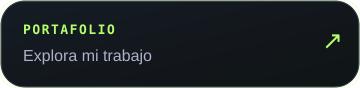
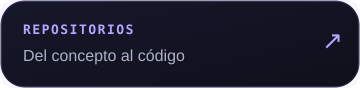
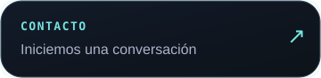
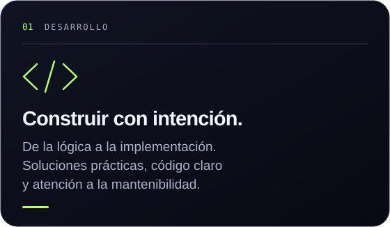
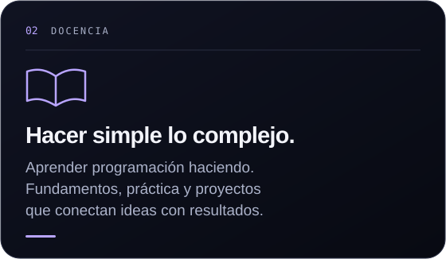
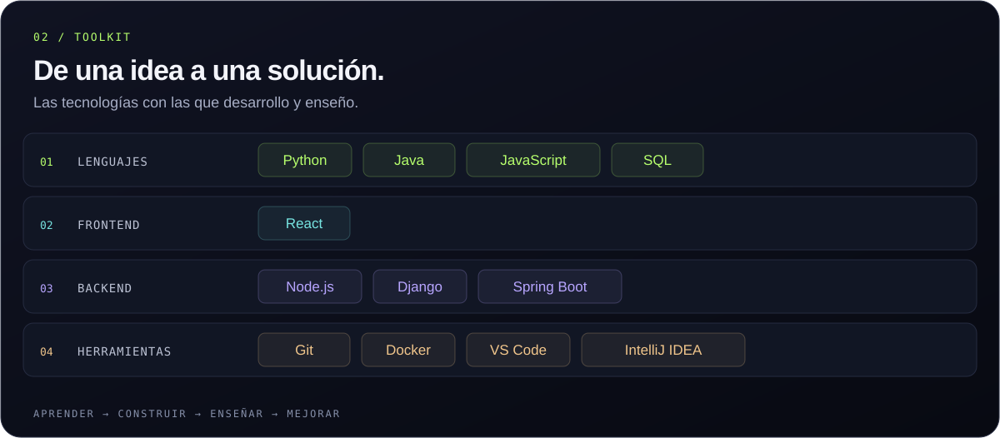
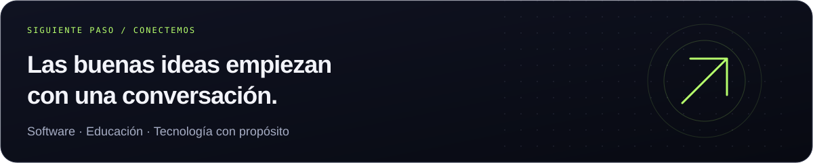

<p align="center">
  
</p>

<p align="center">
  <a href="https://portafolio-personal-cristian-diaz.vercel.app/"></a>
  <a href="https://github.com/cristian7712?tab=repositories"></a>
  <a href="mailto:cristian.diaz8918@gmail.com"></a>
</p>

<br />

### `01 / IDENTIDAD` &nbsp; Dos vocaciones. Una misma curiosidad.

Soy **Cristian David Díaz Tovar**, desarrollador de software y docente de programación en **Pasto, Colombia**. Me mueve entender cómo funcionan las cosas, construir soluciones útiles y compartir lo que aprendo.

Para mí, escribir código y enseñar tienen algo en común: **hacer que lo complejo tenga sentido**.

<p align="center">
  
  
</p>

<br />

<p align="center">
  
</p>

<details>
<summary><strong>Explorar el stack en texto</strong></summary>

| Área | Tecnologías |
| :--- | :--- |
| Lenguajes | Python · Java · JavaScript · SQL |
| Frontend | React |
| Backend | Node.js · Django · Spring Boot |
| Herramientas | Git · Docker · Visual Studio Code · IntelliJ IDEA |

</details>

<br />

### `03 / EN EL RADAR` &nbsp; El aprendizaje no se detiene.

```text
cristian@pasto ~ $ learning --in-progress

  [01] Arquitectura de software
       Diseñar mejor. Cuidar las buenas prácticas.

  [02] Educación interactiva
       Transformar conceptos en práctica.
       Aprender haciendo.

  [03] Automatización
       Simplificar tareas. Mejorar los flujos.
```

<br />

### `04 / FUERA DEL EDITOR` &nbsp; Otras formas de conectar.

La curiosidad también me lleva a la educación, los idiomas y el crecimiento continuo.

**ES** Español nativo &nbsp; · &nbsp; **EN** Inglés intermedio &nbsp; · &nbsp; **IT** Italiano principiante

<br />

<a href="mailto:cristian.diaz8918@gmail.com">
  
</a>

<p align="center">
  <a href="mailto:cristian.diaz8918@gmail.com"><strong>cristian.diaz8918@gmail.com</strong></a>
  &nbsp; · &nbsp;
  <a href="https://portafolio-personal-cristian-diaz.vercel.app/">Portafolio ↗</a>
</p>

<p align="center"><sub>Desde Pasto, Colombia · Con lógica, curiosidad y propósito.</sub></p>
